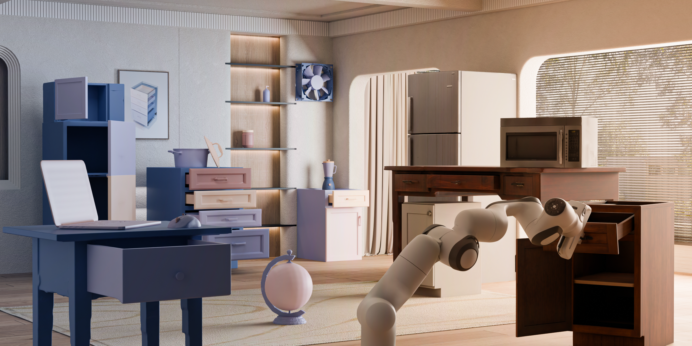

# SPARK: Sim-ready Part-level Articulated Reconstruction with VLM Knowledge

<h4 align="center">

[Yumeng He<sup>*</sup>](https://heyumeng.com/),
[Jiang Ying<sup>*</sup>](https://yingjiang96.github.io/),
[Jiayin Lu<sup>*</sup>](https://jlu227.wixsite.com/kay-lu),
[Yin Yang](https://yangzzzy.github.io/),
[Chenfanfu Jiang](https://www.math.ucla.edu/~cffjiang/)

[](https://arxiv.org/abs/2512.01629)
[](https://heyumeng.com/SPARK/index.html)

<p align="center">
    
</p>

</h4>

Official implementation of [**SPARK: Sim-ready Part-level Articulated Reconstruction with VLM Knowledge**](https://heyumeng.com/SPARK/index.html). SPARK combines VLM-guided part-level and global image guidance with diffusion transformers to produce high-quality articulated object reconstructions from a single image.

## 🔧 Installation

**1. Clone and create the env**

```bash
git clone https://github.com/YumengHe/SPARK-private.git
cd SPARK-private

conda create -n sparkprivate python=3.10 -y
conda activate sparkprivate
```

**2. Install PyTorch + torch-cluster + project dependencies**

```bash
# PyTorch (CUDA 12.4 wheels)
pip install torch==2.5.1 torchvision==0.20.1 --index-url https://download.pytorch.org/whl/cu124

# torch-cluster (must match torch + CUDA)
pip install torch-cluster==1.6.3 -f https://data.pyg.org/whl/torch-2.5.1+cu124.html

# Project dependencies (pins numpy etc. before PyTorch3D is compiled)
pip install -r requirements.txt
```

**3. Point the build at a CUDA 12.4 toolchain**

PyTorch3D compiles CUDA code, so `nvcc` must match the 12.4 wheel above. Pick **one** of the two options below.

<details>
<summary><b>Option A — switch to an existing system CUDA 12.4 (lightweight, recommended if available; <b>AIVC lab members should always use this</b> — our servers already have CUDA 12.4 at this path)</b></summary>

```bash
export CUDA_HOME=/usr/local/cuda-12.4
export PATH=$CUDA_HOME/bin:$PATH
export LD_LIBRARY_PATH=$CUDA_HOME/lib64:$LD_LIBRARY_PATH
nvcc --version   # sanity-check: must report release 12.4
```

</details>

<details>
<summary><b>Option B — install CUDA 12.4 toolkit into the conda env (~3 GB, use if no system CUDA 12.4)</b></summary>

```bash
conda install -c "nvidia/label/cuda-12.4.0" cuda-toolkit -y
export CUDA_HOME=$CONDA_PREFIX
nvcc --version   # sanity-check: must report release 12.4
```

</details>

**4. Build PyTorch3D**

```bash
pip install ninja
pip install --no-build-isolation "git+https://github.com/facebookresearch/pytorch3d.git@stable"
```

`--no-build-isolation` lets the build see the torch we just installed (otherwise pip spins up an isolated env without it).

### Pretrained weights

All checkpoints (PartCrafter, TripoSG, RMBG-1.4) live in
[`2bidoubi/SPARK`](https://huggingface.co/2bidoubi/SPARK) and are fetched into
`pretrained_weights/<name>/` automatically on first run. To pre-download them:

```bash
python -m src.utils.download_weights
```

## 💡 Quick Start

Create an `.env` file and add API key inside:

```
# OpenAI: metadata.json prediction, joint-axis correction, prompt generation
OPENAI_API_KEY=

# Google Gemini: part-image and open-state image generation
GEMINI_API_KEY=

# Meshy: texturing
MESHY_API_KEY=
```

Place input images in `./image/` and run the full pipeline:

```bash
python run.py
```

`run.py` runs nine stages end-to-end (metadata → URDF → per-part image generation → PartCrafter inference → mesh cleanup → texture). Toggle individual steps with the `step1 … step9` flags at the top of the file.

## Articulation-Only From an Existing Textured Mesh

Use this path when you already have a textured, part-segmented mesh and want to
run only the SPARK VLM-guided URDF reasoning and differentiable articulation
refinement. This path does not run DiT, VAE latent generation, DINOv2
conditioning, part-image mesh synthesis, or texture generation.

If the input is a multi-part GLB such as `assets/A_post.glb`, first render an RGB
input image:

```bash
sudo docker compose run --rm spark python scripts/render/glb.py \
  --input assets/A_post.glb \
  --output_dir output/A_post_render \
  --single \
  --camera-y 1 \
  --target-y 1
```

Then split the GLB into per-part mesh files:

```bash
sudo docker compose run --rm spark python URDFoptimizer/render/split_glb.py \
  --input assets/A_post.glb \
  --output output/A_post_parts
```

The articulation-only URDF generator needs to know which segmented mesh belongs
to each URDF link. There are three supported ways to provide that mapping:

1. Put `mesh_filename` or `mesh_path` directly in each `metadata.json` part.
2. Use `--mesh-dir` when files are named by the default pattern
   `part_00.glb`, `part_01.glb`, ...
3. Use an explicit `mesh_map.json`, which is recommended when split GLB part
   names contain semantic suffixes or when VLM link order must be checked.

Example `output/A_post_articulation/mesh_map.json`:

```json
{
  "link0": "../A_post_parts/part_0_body.glb",
  "link1": "../A_post_parts/part_1_left_door.glb",
  "link2": "../A_post_parts/part_2_right_door.glb"
}
```

The keys must match the labels in `output/A_post_articulation/metadata.json`.
The paths are resolved relative to the generated URDF directory.

To create that mapping visually, first generate the LLM link metadata:

```bash
sudo docker compose run --rm spark python VLMguidance/generate_json.py \
  --input output/A_post_render/front_view.png \
  --output output/A_post_articulation/metadata.json \
  --csv VLMguidance/partnet-mobility-data-analysis.csv
```

Then open the split-mesh HTTP mapper on the server and connect to
`http://<server-ip>:7860` from your browser. Each split GLB is shown in a 3D
viewer and can be assigned to one LLM-predicted link. Assigning multiple GLBs to
the same link writes a list in `mesh_map.json`, and `generate_urdf.py` treats
that list as one rigid link with multiple visual meshes.

```bash
sudo docker compose run --rm -p 7860:7860 spark python URDFoptimizer/render/mesh_map_web.py \
  --metadata output/A_post_articulation/metadata.json \
  --split-dir output/A_post_parts \
  --output output/A_post_articulation/mesh_map.json
```

You can also launch the same GUI immediately after splitting:

```bash
sudo docker compose run --rm -p 7860:7860 spark python URDFoptimizer/render/split_glb.py \
  --input assets/A_post.glb \
  --output output/A_post_parts \
  --metadata output/A_post_articulation/metadata.json \
  --mesh-map-output output/A_post_articulation/mesh_map.json \
  --launch-web
```

Run the articulation-only pipeline:

```bash
sudo docker compose run --rm spark python run_articulation.py \
  --image output/A_post_render/front_view.png \
  --output-dir output/A_post_articulation \
  --skip-vlm-structure \
  --mesh-map output/A_post_articulation/mesh_map.json \
  --camera-y 1 \
  --target-y 1 \
  --iters 200 \
  --image-size 256 \
  --device cuda
```

Output:

```text
output/A_post_articulation/mobility_refined.urdf
output/A_post_articulation/URDFoptimize_spark/optimization_summary.json
```

## 📚 Data Preprocessing

See [`datasets/README.md`](datasets/README.md) for the full pipeline. A typical PartNet-Mobility flow:

```bash
# Convert PartNet-Mobility (obj+mtl) to GLB
python datasets/merge_to_glb.py mesh/partnet_test mesh/partnet_glb

# Voxelize meshes
python datasets/voxel_surface.py mesh/partnet_glb --subfolder -r 200

# Build PartCrafter training data
CUDA_VISIBLE_DEVICES=0 python datasets/preprocess/preprocess_partnet.py \
    --input mesh/partnet_glb --output preprocessed_data
```

## 🏋️ Training

```bash
bash scripts/train/train_partcrafter.sh --config configs/mp16_nt1024.yaml
```

Set `WANDB_API_KEY` in the script if you want experiment tracking.

## 🚀 Common Script Entrypoints

Single-image object inference:

```bash
python scripts/inference/object.py \
    --image_path image/example.png \
    --num_parts 4 \
    --output_dir results \
    --render
```

Per-part image inference:

```bash
python scripts/inference/part_images.py \
    --image_folder output/example_case \
    --output_dir results \
    --render
```

Render a generated mesh:

```bash
python scripts/render/glb.py \
    --input results/example/object.glb \
    --output_dir render_output \
    --gif
```

## 🗂️ Script Layout

- `scripts/inference/`: inference entrypoints
- `scripts/render/`: mesh and URDF rendering helpers
- `scripts/train/`: training launch scripts
- `scripts/batch/`: batch inference runners
- `scripts/tools/`: maintenance utilities
- `scripts/legacy/`: archived old scripts

## 🤗 Pushing Pretrained Weights to HuggingFace

For maintainers / internal use. After (re-)training, upload the contents of `pretrained_weights/` to [`2bidoubi/SPARK`](https://huggingface.co/2bidoubi/SPARK) so others auto-download via `src.utils.download_weights`.

**1. Get a write token** at https://huggingface.co/settings/tokens (Type → **Write**).

**2. Log in.**

```bash
hf auth login
```

**3. Install the Xet backend** (5–10× faster uploads for large files):

```bash
pip install hf_xet
```

**4. Upload.** The script auto-creates the repo and uses `upload_large_folder` (parallel, resumable, auto-LFS):

```bash
python scripts/tools/upload_weights.py
```

If the upload is interrupted, just rerun the same command — already-uploaded files are skipped via SHA comparison.

**5. Verify.** Browse to https://huggingface.co/2bidoubi/SPARK and confirm `PartCrafter/`, `TripoSG/`, `RMBG-1.4/` all appear.

## 🙏 Acknowledgement

Thanks to Yongfei She for organizing the code for open source release.

## 📝 Citation

If you find SPARK useful for your research, please cite:

```bibtex
@article{he2025spark,
  title={SPARK: Sim-ready Part-level Articulated Reconstruction with VLM Knowledge},
  author={He, Yumeng and Jiang, Ying and Lu, Jiayin and Yang, Yin and Jiang, Chenfanfu},
  journal={arXiv preprint arXiv:2512.01629},
  year={2025}
}
```
